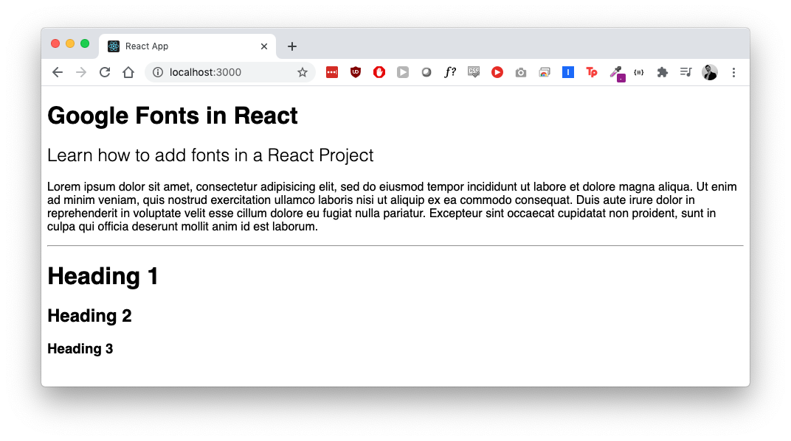

# change-font



Repository to quickly show how to change a font in React. 

Add fonts to `src/fonts`.

In `src/App.css`

```css
body {
  font-family: 'Messina-sans', sans-serif
}
.heading {
  font-weight: 700;
}
.subheading {
  font-weight: 300;
}
```

In `src/index.css`

```css
@font-face {
  font-family: 'Messina Sans';
  src: url('./fonts/MessinaSans-Regular.eot');
  src: local('Messina Sans Regular'), local('MessinaSans-Regular'),
      url('./fonts/MessinaSans-Regular.eot?#iefix') format('embedded-opentype'),
      url('./fonts/MessinaSans-Regular.woff2') format('woff2'),
      url('./fonts/MessinaSans-Regular.woff') format('woff'),
      url('./fonts/MessinaSans-Regular.ttf') format('truetype');
  font-weight: normal;
  font-style: normal;
}
```